[Return to ReadMe file](README.md)

## Table of Contents

### 1. [Version Control](#version-control)

### 2. [Heroku](#heroku)

### 3. [Amazon Web Services](#aws)

### 4. [Github](#github)


## Version Control

- This project was built using [GitPod](https://gitpod.io/workspaces/) as the code editor.

- The repository is hosted on [Github](https://github.com/) with all code being stored here.

- For the build of this project Git has been used for all version control. 

- A few occasions that I needed to go back to a previous commit, the command `git revert <COMMIT ID>` was used.


## Heroku

The crafty shop project is live and deployed to [Heroku](https://dashboard.heroku.com/). To deploy your own project using Python and Djano, follow the below steps:

1. All the project dependencies, packages, and requirements installed have to be included in a `requirements.txt` file, placed on the root directory. To automatically save all the installed dependencies you can use the command `pip3 freeze > requirements.txt`. If you haven't created a file before running this command, it will automatically create one for you. If at any point you need to install all the dependancies stated on the requirements file, you can do so by running the `pip3 install -r requirements.txt` command. 

2. Make sure you set then environment variables either on a `env.py` or on the gitpod variables, accessed from the workspace page, inside the settings tab.
Create a new SECRET KEY and make sure not to include any of the passwords on version control! 
- If you have already set your STRIPE account, you can find the necessary stripe keys within the API and Webhook tabs.
- Set these variables:
    ```
    SECRET_KEY = <'Your Key Here'>
    STRIPE_SECRET_KEY = <'Your Key Here'>
    STRIPE_PUBLIC_KEY = <'Your Key Here'>
    ```
3. Create a Procfile file. Without this, Heroku cannot successfully execute and run. This file lets Heroku know what server is being used. For this, install `Gunicorn`, and add the following line to your Profile document: `web: gunicorn [YOUR APP NAME].wsg:application `

4. Commit and Push all those changes to the GitHub repository.

5. Login to your Heorku account and select 'Create New App' at the top right. Choose a unique name and select a region closest to you.

    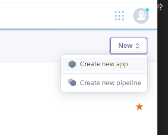

6. Choose the provisions tab and select Postgres database for the app. Search Heroku Postgres and choose the 'Hobby Dev - Free' option.

7. If not done yet, using the command line install the following:
    - `pip3 install dj_database_url`
    - `pip3 install psycopg2-binary`
    - `pip2 install gunicorn`

8. On settings.py import dj_database_url at the top and remove the Django database configurationa and replace with:

    ```
    if 'DATABASE_URL' in os.environ:
        DATABASES = {
            'default': dj_database_url.parse(os.environ.get('DATABASE_URL'))
        }
    else:
        DATABASES = {
            'default': {
                'ENGINE': 'django.db.backends.sqlite3',
                'NAME': os.path.join(BASE_DIR, 'db.sqlite3'),
            }
        }
    ```
    this will set the logic to use either the local or the heroku database on development or production.

9. Find `DATABASE_URL` variable to your Heroku variables (under settings). Click reveal config vars and copy the variable. Add it to your local environment and If using Gitpod, restart the workspace.

    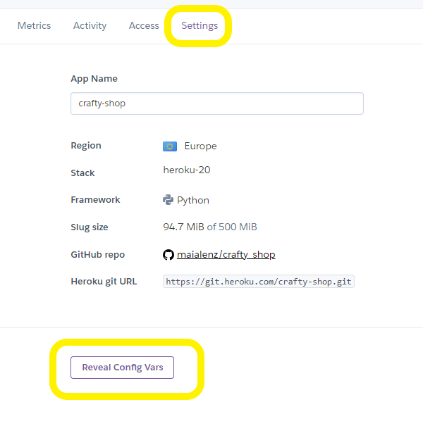#

10. In your IDE, migrate the local database to Heroku. start with the with the models first:
    - Run `python3 manage.py migrate`
    - Then to re-create the database run - `python3 manage.py dumpdata --exclude auth.permission --exclude contenttypes > db.json` this creates a backup of the database and dumps all necessary data into a json file.
    - To export this data to Heroku run - `python3 manage.py loaddata db.json`

11. To access the admin dashboard of the site, you have to create asuperuser for the deployed version:
    - `python3 manage.py createsuperuser` and fill the required fields

12. Before deployment, it's necessary to tell Heroku not to collect static files. Within the Heroku Vars add a new variable:
`DISABLE_COLLECTSTATIC = 1`

13. Add the new app name to the allowed hosts within settings.py: 
    - Example: `ALLOWED_HOSTS = ['crafty-shop.herokuapp.com', 'localhost']`

14. Once everthing is in place, you can add, commit and push the changes to the repository

15. Once again, you need to push the main branch to Heroku. Use these commands:
    - `heroku git:remote -a heroku-app-name`
    - `git push heroku main`

16. To allow automatic pushes to the main Heroku branch, You can connect automatic deployments connecting heroku to github. Once it's connected go to the bottom of the page and select 'Enable Automatic Deployments'.

    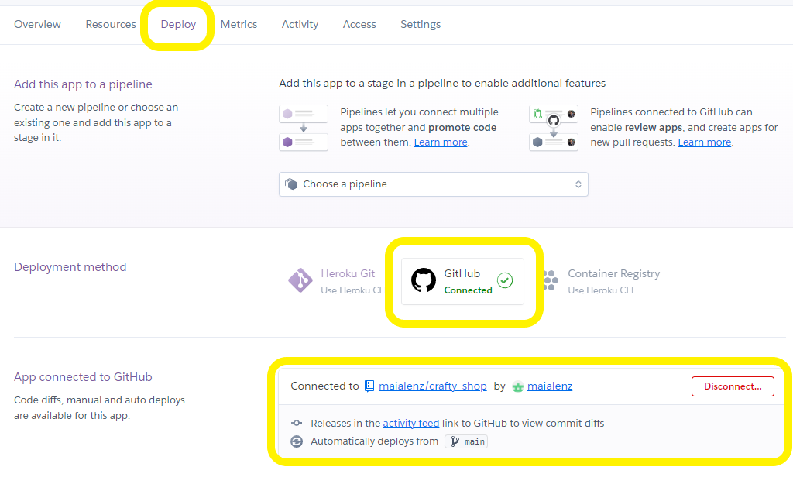


## AWS

As an alternative way to store the static files, I chose to use Amazon's S3 services as a host to the static and media files. To set a S3Bucket, you must have finished your deployment process.

1. Create an AWS account, and choose Personal Account. Add user credentials and inset credit card details. This is a must, but the card will not be charged, unless you go above the free plans.

2. Within the AWS Management Console, under the service tab, look for storage and select S3:
    
    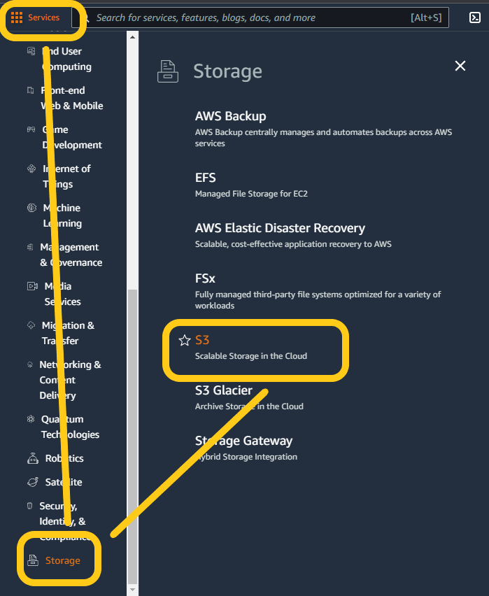

3. Click on Create Bucket. You will need to create a unique name for the bucket (best to choose something that is similar to your project) and AWS region. Choose the closest one to you.
You will need to Disable (un-tick) the checkbox to 'Block all public access', so your bucket can be public and be accessed:

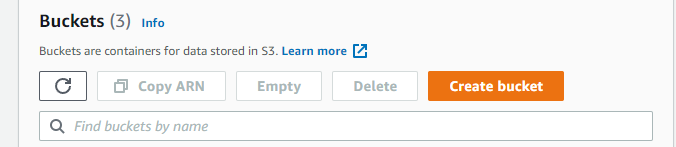
    
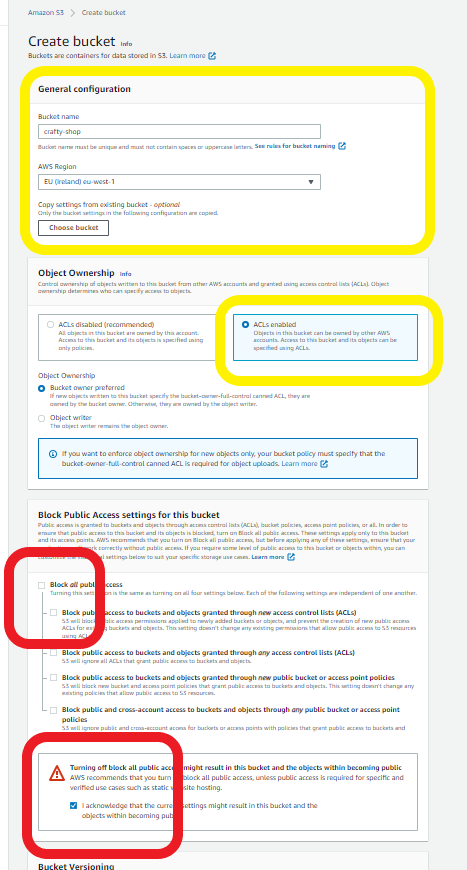

4. Once the bucket is created, click on it and inside go to the properties tab. All the way at the bottom, select edit on 'Static Website Hosting' and enable it:


5. Once accepted, go to the permissions tab and scroll down to the CORS section, select edit and add the code facilitated by CI

    ```
    [
        {
            "AllowedHeaders": [
                "Authorization"
            ],
            "AllowedMethods": [
                "GET"
            ],
            "AllowedOrigins": [
                "*"
            ],
            "ExposeHeaders": []
        }
    ]
    ```
6. Still within the permission tab, go to the bucket policy section and select edit. Click on the Policy Generator button and configure it: 

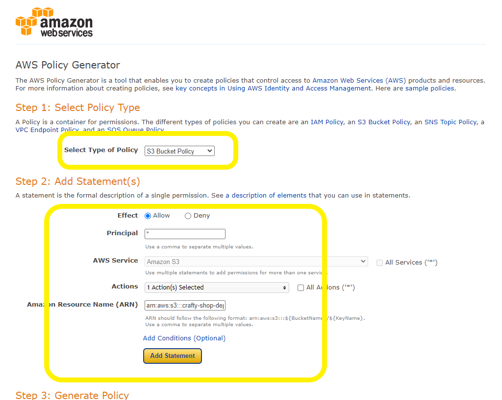

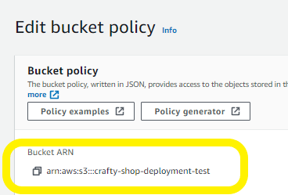

7. When you paste the policy generated, paste it on the box, and dont save until you have included `/*` behing the Resource key. This will show you the arn:::... number, but you manually have to add the /* at the end

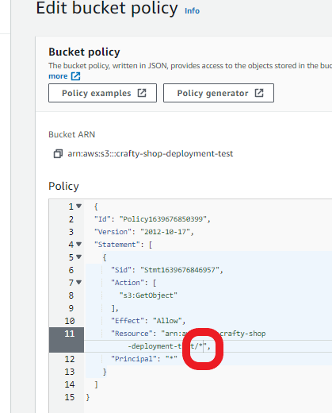

7. On the permissions tab, scroll down until you see Access Control List section and choose to edit. Add Everytone to the list:

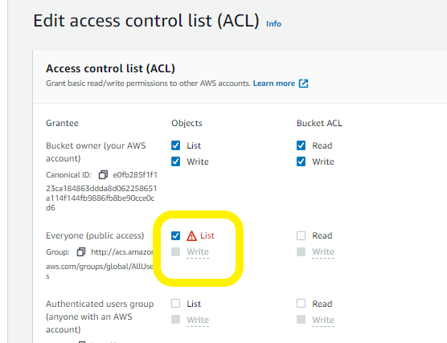

8. This done, go to the IAM tab,, and select groups:

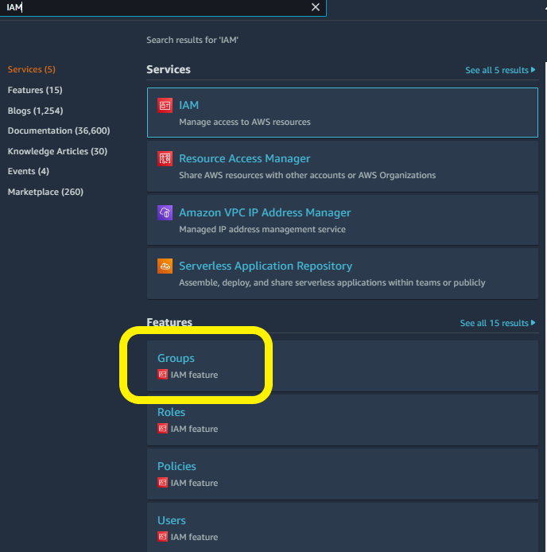

Once here, click on the right top blue button saying `Create Group` and name your group. It's a good idea to call it manage-{project-name}. Once named, accept and click yes all the way.

9. In the sidebar, select the Policies link and create policy. Choose the JSON tab. Import managed policy link and search for S3 and import the policy called `AmazonS3FullAccess`

This policy will need changing due to our partiqular requirements. Copy the ARN snipet and add it to the Resourse value. Example:

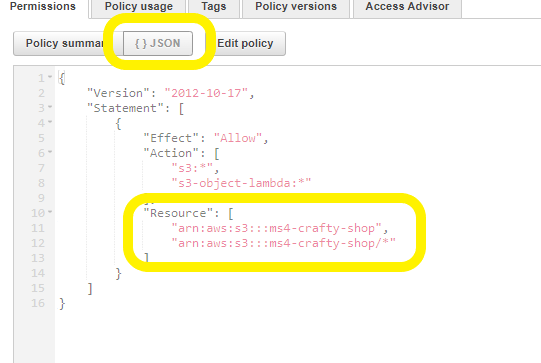

Once you have done this, select review policy, give it a name and description, and push create policy. You have to attach that policty to the created group by choosing `User Groups` tab in the sidebar. 
Choose the app group, select attach policy. search for the newly created policy and attach

10. Once all this is done, you have to create a user to add to the group. Select the users link in the sidebar, then click on the `Add User` button. The best practice to call a name is 'APP-NAME-staticfiles-user' then check the Programmatic access box and choose next. 
Make sure you choose the correct group that will be displayed and click through to create a new user. You will see a success mesage with an option to download `.csv`, which contains the credentials needed. DOWNLOAD THIS DOCUMENT AS YOU CANNOT ACCESS IT AGAIN! And make sure it's safely stored, as it contains very sensitive information.


11. To connect the app to the new S3 bucket you have to install two packages:
- `pip3 install boto3`
- `pip3 install django-storages`

12. Go to Heroku and add the new variables we will need . You can find the credentials for these in the downloaded .csv document. The variables to add are
    ```
    AWS_ACCES_KEY_ID =
    AWS_SECRET_ACCESS_KEY =
    USE_AWS = True
    ```

13. Back in our workspace, Add this logic to settings.py to guide the app to use the created AWS

    ```
    if 'USE_AWS' in os.environ:
        # Bucket config
        AWS_STORAGE_BUCKET_NAME = 'cbd-shield'
        AWS_S3_REGION_NAME = 'eu-west-2'
        AWS_ACCESS_KEY_ID = os.environ.get('AWS_ACCESSS_KEY_ID')
        AWS_ACCESS_KEY_ID = os.environ.get('AWS_SECRET_ACCESSS_KEY')
        AWS_S3_CUSTOM_DOMAIN = f'{AWS_STORAGE_BUCKET_NAME}.s3.amazonaws.com'

        # Static and media files
        STATICFILES_STORAGE = 'custom_storages.StaticStorage'
        STATICFILES_LOCATION = 'static'
        DEFAULT_FILE_STORAGE = 'custom_storages.MediaStorage'
        MEDIAFILES_LOCATION = 'media'

        # Override statuc abnd media URLs in products
        STATIC_URL = f'https://{AWS_S3_CUSTOM_DOMAIN}/{STATICFILES_LOCATION}/'
        MEDIA_URL = f'https://{AWS_S3_CUSTOM_DOMAIN}/{MEDIAFILES_LOCATION}/'
    ```

14. Once you have added the conditional to use AWS, create a file in the apps rood directory. Call it `cutom_storages.py` and add the follwoing code to Allow dnago to use AWS in production.

    ```
    from django.conf import settings
    from storages.backends.s3boto3 import S3Boto3Storage


    class StaticStorage(S3Boto3Storage):
        '''static files'''
        location = settings.STATICFILES_LOCATION


    class MediaStorage(S3Boto3Storage):
        ''' media files'''
        location = settings.MEDIAFILES_LOCATION

    ```
15. If you save, commit and push the changes now, you will see that a new static folder has been created in S3. Here you can add another folder in the same directory called media. You can add all the images you need for your project here, and once you have done so, click next and choose the option `Grant public read acces to this object` and Upload.

16. To finalize the setup of AWS, you will need to create a new Stripe Webhook, which will target the deployed endpoint of the project. Within Stripe, inside the developers tab, go to webhooks and choose to and endpoint. Copy your deployed apps name, but before you create it, do not forget to add `/checkout/wh/` to the Endpoint URL. This is very important as without this it will not work. 

You should add the `payment_intent.succeeded` and `payment_intent.payment_failed` events to the endpoint. Once you have done this, choose to update endpoint.

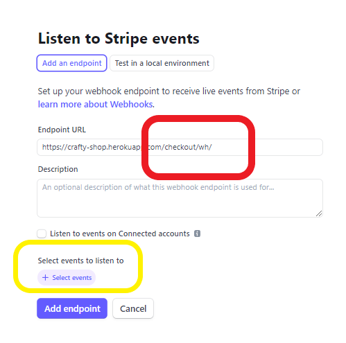

17. This done, now you can reveal the signing secret and you should add it to Heroku's config vars. 
`STRIPE_WH_SECRET`.

