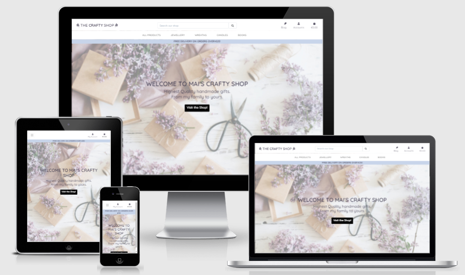
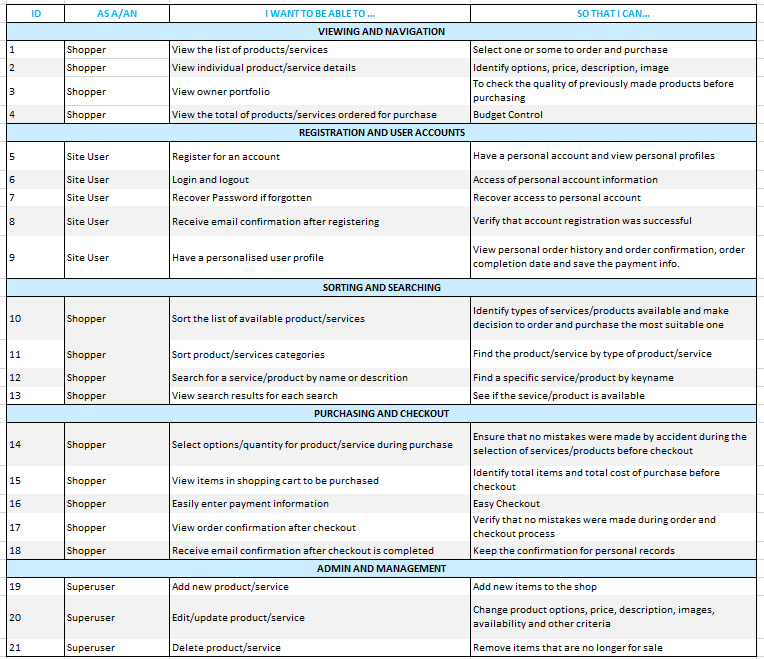

# Mai's Crafty Shop

## Introduction

The Crafty Shop is an e-commerce website offering personalized and handmade products. 

-   [View the Crafty Shop Heroku App](https://crafty-shop.herokuapp.com/)
-   [View the repository on GitHub](https://github.com/maialenz/crafty_shop/)

This is Milestone 4 of the Full-Stack Web Development Diploma Course by UCD and Code Institute. 

The Crafty Shop is a fully functionioning e-commerce Django web application, built in using Python and backed by PostgreSQL (and SQLite3 for development mode) database, and Deployed using Heroku. It allows users to purchase products and register an account with full CRUD functionality. For styling Bootstrap was used and the shop has the posibility to take real payments on a future. 

**ATTENTION!** At this moment the website is set up for educational purposes only, and the Stripe Payments is not taking real cards. To test the card payments, first create an account and use the following card number: 4242 4242 4242 4242 ; expiry date: 42 42 and CVC: 424.

[Click here to view the project live.](https://crafty-shop.herokuapp.com/)
  
---

## Table of Contents

### 1. [UX](#ux) 

#### 1.1. [Goals](#goals)
##### 1.2.1. [Visitor Goals](#visitor-goals)   
##### 1.2.2. [Business goals](#business-goals)

#### 1.2. [User Stories](#user-stories)

#### 1.3. [User Centered Design](#user-centered-design)
- Strategy 
- Scope 
- Structure 
- Wireframes

### 2. [Design](#design)
- Colours
- Typography
- Icons
- Logo
- Imagery

### 3. [Database Structure](#database-structure)
#### 3.1. [Database Choice](#database-choice)
#### 3.2. [Data Models](#data-models)

### 4. [Features](#features)
#### 4.1. [Existing Features](#existing-features)
#### 4.2. [Features Left to Implement](#features-left-to-implement)

### 5. [Technologies Used](#technologies-used)
#### 5.1. [Syntax](#syntax)
#### 5.2. [Frameworks, Libraries & Programs](#frameworks-,-libraries-,-&-programs)

### 6. [Testing](#testing)
- [Testing Document](TESTING.md)

### 7. [Deployment](#deployment)
- [Deployment Document](DEPLOYMENT.md)

### 8. [Credits](#credits)
#### 8.1. [Resources](#resources)
#### 8.2. [Code](#code)
#### 8.3. [Media](#media)

----

# UX

## Goals

As the Covid-19 pandemic has forced businesses around the world to have to close their doors for months and mothns, many have been left with no choice but to adapt quickly and take the goods and services online.

As most of us found ourselves in this position and were forced to work/study from home, we started finding other ways to entretain and keep busy in our homes. We started crafting, baking, cooking, and now they are a large part of our daily rutines. We have also started appreciating hand made things and supporting small and community businesses that received a big push back due to the situtation.

So it's understandable when many have decided to move from traditional retail to e-commerce. 
This website wants to offer those who appreciate the handmade crafts and the quality that comes with it.

### Visitor Goals

The target audience for The Crafty Shop are:
- People who value handmade items
- People searching for unique gifts
- People that enjoy art

User Goals:
- Get inspiration
- Find a gift
- Be able to navigate the shop easily, find what they need and make a secure purchase
- Buy from a small shop

### Business Goals

The goals of The Crafty Shop business are;
- To provide a professional online shop.
- To sell homemade and handmade crafts to its users
- Build brand awareness.
- Build an online pressence

---

## User Stories

---

## User Centered Design

### Strategy

- The main goal of this website is to convert visitors into frequent customers. As the items shown in this website are handcrafted items, the products will be shown in a very minimalistic way, with minimum imagery and clutter to show that the products are made in the most professional manner, clean and tidy. To show the customers the type of crafts that are offered on the website, all products will be displayed together, with the option to sort them by name, price, ... as well as having the option to go directly to the category they would like to search.

- To achieve the goals pointed on the goals section, the information will be diplayed to the user inside each item, not to overwhelm the possible customer. The website will show a light but light-in-color palette to give the sense of delicacy and care by the creator.

The steps a new user would idealy take when arriving into the website would be the following:
- Expore the website's landing page, where the information will introduce the user to the products offered within the shop.
- Follow the call to action buttons directing the user either to all the products or the selected category.
- Select the product of their choice and choose the quantity needed
- Following the secure checkout call to action button go to the checkout page and purchase the product/s selected following the instructions on the following pages (delivery information, card information)
- On the delivery instruction page, choose to save the information and create an account 
- Go to the personal account to see their delivery information where they can update personal details, see their latest order.
- Remain a regular user to the shop due to an positive website experience and crafted items.

This will all be achieved through creating a clear, tidy and strong UI focusing on well structured content. Having a creat hirearchy of information and well placed call to action buttons will allow the user to navigate and use the functionalities of the website without the need of instructions

- Technical capabilities:
    - To use this website the user needs to have acces to some internet connection within the chosen device.
    - They also need to have basic understanding on how to select and navigate the page.
    - This page will be done using the Bootstrap framework to create a responsive structure and implement sections that the user needs. The website will be separated in 8 (Landing, Products, Product information, Register, Login, Bag, checkout, Payments). Only registered users will be allowed to access the personal account to see their details. The admin/superuser will be allowed to edit/delete products (accessed under the product name) as well as adding new products.

---

### Scope | Trade Off

- Features within the desing plan with highest priority:
    - Minimal but appealing homepage
    - Navigation links clearly visible on the top of the website
    - Responsive navigation bar
    - Only allow registered users to access and manage their personal accounts
    - Only allow superusers to add/edit/delete new products
    - Detailed information under each product
    - A secured payment system
    - Validated and error free forms
    - Search and sorting functionalities
    - The posibility for the user to check the selected products and to have CRUD functionalities to control their bags.

- Lower priority features that may not be included in the initial release of the website:
    - Contact section to send messages to the Creator
    - A comment section that allows all users to write their own feedback
    - A rating option for products
    - A gallery section connected to customers instagram accounts
    - The functionality to add personalized options for some products
    - Related/recommended products to be displayed under the product choice
    - Footer with social media links, contact information and Links to different categories for easy access

---

### Structure

- The structure of the site will be layed out in ----------- pages. The landing page(homepage) will welcome new and returning users to the page, where they'll see a call to action button that will direct them to the shop where they'll be able to select and purchase different items. Anonymous users wi8ll be allowed to make purchases and will be able to not to make an account, but these will not be able to access the personal accounts where they can see their latest purchases. Normal users are not able to access the full CRUD functionality of the database, being this only accessible for the Admin/Superusers. The latest, will have an extra page where they will be able to insert/edit/delete products. Logged in users will have the logout option to stop their session cookies. The basic structure of the website is:
    - Header/Navigation - *Top Level*
        - The navigation bar will be a hamburger/bars menu icon on smaller screen sized. It is not sticky as there will be a back to top icon throught the site for UX purposes.
        - The navigation menu will feature a search bar allowing users fast and immediate search of the site to quickly find the products they are looking for. 
        - Categories will be displayed in button/link form to access same category products in a faster way.
    - Body - *Main Page Elements*
        - The product page overview will show a typical webshop layout including cards with product images, product name, price and a button to direct the user to the detailed page of the selected product for further inspection.
        - The individual product page will include the product's image, a description, price and add to bag button.
        - The bag page will show the summary of the product selection with the extra prices added with the grand total showing at the bottom of all products added to the bag for the consideration of the customers before the purchase.
        - The order confirmation page will display all the users details to confirm the order was successfully delivered.
    - Footer - *Bottom level*
        - Copyright information
        - Contact information

---

### Wireframes

The wireframes were created using [Balsamiq](https://balsamiq.com/) to design and plan the project
- [Mobile Wireframes ](docs/Readme/wireframes/mobile-wireframes.png)
- [Ipad Wireframes ](docs/Readme/wireframes/ipad-wireframes.png)
- [Desktop Wireframes ](docs/Readme/wireframes/desktop-wireframes.png)

---

# Design

The Crafty Shop website will have an overall simplistic and minimalist feeling, to emphasis a clean and high quality crafts and items on sale. 

### Colors

- The color scheme for this webshop will contain three main colors: A primary color, secondary and accent colors. In the places where accessibility requires a darker tone, this will be achieved with darker tones of the same colors.
- For the success and error colors red and green will be used, as these are obvious to everybody. 
- The colors will be taken from the brand logo, to keep a professional and pull the site together.
- Chosen colors:
    - #c8d5ea: very light blue/purple with gray hues to give a light and tidy feeling to the shop.
    - #000 - Black: used for important CTA, where it is important to get the users' attention. It's used in primary buttons.
    - #fff - White: to keep the website clean, tidy, organised. It gives the user the feeling the creator cares how items are presented.
    - 3f3a4f - Dark Blue/Purple : to give an almost dark color to heading. The color is not as prominent as the black is, creating a difference between heading and subheadings.

### Typography

- There will be two fonts used throughout the website.  Quicksand will be used and the main font for all the website, as it keeps all harmonious and balanced. Different weights and sizes have been used to fit the diffrenet circumstances of the use. Sans-serif will be used as a fallback alternative in case of unsuported font.
    - Quicksand: Rounded but simple font. It has a informal but professional style, suited for a shop were users are spending their money but they may feel closer to the artist/creator
    - Sans-Serif: used as a fallback font
- Both fonts were taken from [Google Fonts](https://fonts.google.com/) to avoid unsuported browser/systems. 

### Icons

- To keep a simplistic and minimalistic feeling only the most necessary icons were used. The icons were taken from [Fontawesome](https://fontawesome.com/v6.0)
    - Search icon: to hint the user it references the searchbar
    - Shopping cart icon: to visually indicate where the products added are located
    - User icon: To let the user know in a simple look, that it references at the account and features related to them.
    - Feather icon: Representing the blog

### Logo

- The favicon has been created using [Canva]() for a personalized and custom brand. It displays some geometrical figures hinting to clay. with very suttle/earthy colors, keeping the handcrafted mindset of the website.

### Imagery

- Imagery will be used but will be used only when necessary, like to show product images to users. There might be used as a landing page image as an introduction to the shop to welcome the user to the store and increase expectation of what they will find along the website. 
- The images representing the products, will be as simple as possible, just representing the product on a single images. 

---

# Database Structure

## Database Choice
- This project uses two different types of databases, one for local development and one for the production version. As the Crafty Shop was built on Djnago, during the local development the standard Django's built in **MySQL** (sqlite3) database was used. On deployment on Heroku, the database was changed to **PostgreSQL** database, which is provided by Heroku as an add-on for production.

## Data Models

### User

The Django’s default user model for authorization is has been used, which allows the project to meet one of the main requirements of separating features by anonymous users, users in session and superusers. This User model is the standard `django.contrib.auth.models`.

**NOTE**: The structure of the Checkout and Products apps have been inspired by *Boutique Ado*, which was previously creaded following videos created by Code Institute.

### Profiles App

**UserProfile Model**

| **Name** | **Database Key** | **Validation** | **Field Type** |
--- | --- | --- | --- 
User | user | on_delete=models.CASCADE | OneToOneField 'User'
Phone number | default_phone_number | max_length=20, null=True, blank=True | CharField
Address Line1 | default_street_address1 | max_length=80, null=True, blank=True | CharField
Address Line2 | default_street_address2 | max_length=80, null=True, blank=True | CharField
Postcode | default_postcode | max_length=20, null=True, blank=True | CharField
Town/City | default_town_or_city | max_length=40, null=True, blank=True | CharField
County | default_county | max_length=80, null=True, blank=True | CharField
Country | default_country | blank_label='Country', null=True, blank=True | CountryField

### Products App

**Product Model**

| **Name** | **Database Key** | **Validation** | **Field Type**|
--- | --- | --- | --- 
Category | category | null=True, blank=True, on_delete=models.SET_NULL | ForeignKey 'Category'
Sku | sku | max_length=254, null=True, blank=True | CharField 
Name | name | max_length=254 | CharField 
Description | description | max_length=700 | TextField
Image URL | image_url | max_length=300, null=True, blank=True | URLField
Image | image | null=True, blank=True | ImageField
Price | price | max_digits=6, decimal_places=2 | DecimalField 
Has Sizes | has_sizes | default=Flase, null=True, blank=True | BooleanField

**Category Model**

| **Name** | **Database Key** | **Validation** | **Field Type** |
--- | --- | --- | ---
Name | name | max_length=254 | CharField 
Friendly Name | friendly_name | max_length=254, null=True, blank=True | Charfield 

### Checkout App

**Order Model**

| **Name** | **Database Key** | **Validation** | **Field Type** |
--- | --- | --- | --- 
Order Number | order_number | max_length=32, null=False, editable=False | CharField
User Profile | user_profile | on_delete=models.SET_NULL, null=True, blank=True, related_name='orders'| ForeignKey 'UserProfile' 
Full Name | full_name | max_length=50, null=False, blank=False | CharField 
Email | email | max_length=254, null=False, blank=False | EmailField 
Country | country | blank_label='Country*', null=False, blank=False | CountryField
Postcode | postcode | max_length=20, null=True, blank=True | CharField 
Town/City | town_or_city | max_length=40, null=False, blank=False | CharField
Phone number | phone_number | max_length=20, null=False, blank=False | CharField 
Street Address 1 | street_address1 | max_length=80, null=False, blank=False | CharField
Street Address 2 | street_address2 | max_length=80, null=False, blank=True | CharField 
County | county | max_length=80, null=True, blank=True | CharField
Date | date | auto_now_add=True | DateTimeField
Order Total | order_total | max_digits=10, decimal_places=2, null=False, default=0 | DecimalField
Grand Total | grand_total | max_digits=10, decimal_places=2, null=False, default=0 | DecimalField
Original Bag | original_bag | null=False, blank=False, default ='' | TextField
Stripe Pid | stripe_pid | max_length=254, null=False, blank=False, default='' | CharField

**OrderLineItem Model**

| **Name** | **Database Key** | **Validation** | **Field Type** |
--- | --- | --- | --- 
Order | order | null=False, blank=False, on_delete=models.CASCADE, related_name='lineitems' | ForeignKey 'Order'
Product | product | null=False, blank=False, on_delete=models.CASCADE | ForeignKey 'Product'
Product Size | product_size | max_length=2, null=True, blank=True | CharField
Quantity | quantity | null=False, blank=False, default=0 | IntegerField
Lineitem Total | lineitem_total | max_digits=6, decimal_places=2, null=False, blank=False, editable=False | DecimalField 

### Reviews App

**ProductReview Model**

| **Name** | **Database Key** | **Validation** | **Field Type** |
--- | --- | --- | --- 
Product | product | related_name='reviews', on_delete=models.CASCADE | ForeignKey 'Product'
User | user | on_delete=models.CASCADE | ForeignKey 'User'
Content | content | blank=True, null=True | TextField
Rating | rating | --- | IntergerField
Date Added | date_added | auto_now_add=True | DataTimeField

### Blog App

**Post Model**

| **Name** | **Database Key** | **Validation** | **Field Type** |
--- | --- | --- | --- 
Post Category | postcategory | null=True, blank=True, on_delete=models.SET_NULL | ForeignKey 'Postcategory'
Title | title | max_length=200, unique=True | CharField
Subtitle | subtitle | max_length=150, default='' | CharField
Slug | slug | max_length=200, unique=True | SlugField
Author | author | on_delete=models.CASCADE, related_name='blog_posts' | ForeignKey 'User'
Updated On | updated_on | auto_now=True | DateTimeField
Content | content | --- | TextField 
Created On | created_on | auto_now_add=True | DateTimeField
Status | status | choices=STATUS, default=0 | IntegerField
Image URL | image_url | max_length=1024, null=True, blank=True | URLField
Image | image | null=True, blank=True | ImageField

**PostCategory Model**

| **Name** | **Database Key** | **Validation** | **Field Type** |
--- | --- | --- | --- 
Name | name | max_length=254 | SlugField
Friendly Name | friendly_name | max_length=254, null=True, blank=True | CharField

**Comment Model**

| **Name** | **Database Key** | **Validation** | **Field Type** |
--- | --- | --- | --- 
Post | post | on_delete=models.CASCADE, related_name='comments' | ForeignKey 'Post'
Name | name | max_length=80 | CharField
Email | email | null=False, blank=False | EmailField 
Body | body | --- | TextField
Created On | created_on | auto_now_add=True | DateTimeField
Active | active | default=True | BooleanField

---

# Features

## Existing Features

### Elements on every page

**Navbar:**
- The navbar features on every page. All links are accessible at any point in case the user want to get to a different section to add a more items to the cart.
- The navbar has a logo on the left, linking the homepage. The logo dissapears on medium and small screens to keep the navbar tidy and uncluttered
- In mobile view, the navigation will collapse into a burger icon situated on the left hand side, to avoid unwanted accidental clicks and opening of the expanded navbar
- It will be responsive on most devices.
- The shopping bag will be placed on the right hand side making sure is easy to spot.
- The shopping cart works even for users not registered or logged in.
- Logged out users will be able to see the options to log in, register, product pages, access blog posts, read reviews. 
- Logged in users will be able to access their accounts, the blog page, and return home as well as logging out and end their session.
- Search bar will be located in the navbar
- The searchbar will be collapsed into the burger icon on medium and small viewports to keep it out of sight
- For logged in superusers there is an option to directly add a new product from under their account tab to keep things easy and reacheable.
- All toast messages will appear under the navbar with the same fonts used along the website to keep consistency.
- Depending on the type of mesage, the toast's top color changes to refelct the type of message.
- Accross the webiste, toast messages will appear to convirm the contents o a users bag when they take an action. The superuser will also be prompted with toast messages when adding/deleting/reviewing/updating something.

**Delivery/Discount Banner:**
- The banner makes the user aware of the latest offers. In our case, the user will be made aware of the free shipping posibility when they spend 25€ or more, and like this increase the profits by conversion.

**Back to Top Button:**
- All long pages will be provided with an arrow to scroll to the top to automatically bring the user to the top of the page. This avoids the need for the user to manually have to scroll all the way up.

**Home/Landing Page:**
- The home page will feature a hero image taking most of the page as a welcome page. Inside it will have the name of the shop and a brief description with a CTA button that will redirect the user to the main product page where they'll be able to start their shopping journey.

**Products/Shop Page:**
- *Categories* button under the navbar for easy access to different categories of products/items
- *Sort* option will allow to sort the products on the page by price (high to low and low to high), name (a-z or z-a)
- *Products* list
    - The products in the shop they'll be represented by an image. The name, category and price will be placed under the image
    - The products will be placed using card class from bootstrap
    - Each product will have a button under at the bottom, which opens the product individually, showing the description and the options to increase the quantities to be added to the cart
- *Edit/Delete* products for Superusers.

**Product Detail Page:**
- This page can be accessed from the CTA button under each product card on the Shop page.
- In this page the users can find the Image, Title or name of the product, description of the item, the category it belongs to and the price of the item.
- The users will have the option to select the amount of items they would like to add to the cart.
- There will be a section for users to leave reviews of each products, having the option to select the rating. The name updates automatically and it'll have a timestamp. The reviews will be organized from newest to oldest
- A form **only** available for login users where they can send the above mentioned review
- Delite and Edit buttons only available for logged in superusers so they can update or remove an item.
- The users will be able to leave a product review under the body of the product. **Only** logged in users will have access to the form where they can choose their rating and comment.
- The users will be able to see reviews left by other shop users reviews on time order

**Profile Page:**
- Non-Logged or non-registered users will have the options to LogIn or Register for an account.
- *My Account*: This page will be accessible to *Registered* users **only**
    - Users that have registered and logged in will be able to access their individual page where they can see and edit their delivery/billing information
    - Here logged users can see their past orders, if there were any.

**Bag Page:** 
- This follows already well know e-commerce style for shopping carts. 
- The users will be able to see the items they have added to the shopping basket
- The information for each items will be displayed for the users review. They will have the option to remove an item from the cart or update it (qty, adding more items by going to the main product page again)
- A checkout button will invite the users to confirm the order by finishing the payment.
- The shipping price will be updated depending if the user has met the necessary requirements for a free delivery or not. This will be added to the card automatically.
- If a user is not finished with the shoppings, a button will redirect them back to all the products page, where they can continue adding more products into their carts

**Checkout Page:**
- This can be accessed from the bag page.
- Users will be asked to introduce their delivery/billing information.
    - Registered and Logged in Users will find this information prefiled for them. They can change any fields here.
- Users will have the option to save the details introduced on the form on their profile for future purchases. This makes the shopping experience nicer as the customer doesn't have to constantly introduce personal detail.
- Card details are not saved.
- A Secure Checkout button will allow the user to end the payment, confirming the order.
- The payment will be created using Stripe's payment method. This avoids the need to write all the code manually and instead reuse the already available code.
- While the payment is processing, the user will be presented with a spinner loader so they know something is happening and avoid them from closing tabs
- The user will be prompted with validation messages handled by Stripe.

**Order Confirmation/Success Page:**
- This page is only accessible when the payment has been completed. It can also be accessed from the profile page by clicking on top of the Past order numbers. 
- The user is able to see their details as well as the order number for their reference.
- A confirmation email is sent to the user when the payment is successfull.

**Blog Page**
- This section can be accessed directly from the navbar.
- In this page the users have the option to learn tips and share their own with others. 
- On the left side of the page the user will have a few categories to choose their BlogPost from. Each category has same type of posts organised within.
- The user will be able to see a short introduction to the long post: Image, title, date, a short subtitle. Under each post card, a cta button will redirect the user to the detailed page of the chosen blog post.
- Logged superusers will have the option to create a new category and/or a new post directly from this page. As soon as clicking either button, they will be redirected to a respective form.
- Superusers will have the option to edit or delete posts from the main blog page, to make the operation faster.

**Blog Details Page**
- All users will be able to see the title, author, when it was created, the image of the post (can be opened on a blank screen to be printed or others)
- All users are able to see comments left by other users at the bottom of the page. The submittion form is only available to registered and logged in users. 
- Superusers are able to delete comments they find unapropiated.

## Features Left to Implement:
- Featured products at the top showing the top products or seasonal items chosen by the admin/superuser or by popularity.
- Categories at the footer for easier access
- Pagination buttons to provided if there's an increase on product quantity on the website.
- A gallery page showing all products made and pictures customers have send. 
- A gallery showing images that customers have posted on their accounts by the use of tags/hashtags
- Coupons and discount codes: The option to give customers temporary discount codes to use within x amount of time.
- Footer with contact details and posibility to send an email directly to the shopowner.
- At the moment, for lack of time, I was not able to implement the logic to confirm before deletion. This will be implemented on a very near future
- The option to give the users to edit their own comments and reviews. At the moment they can only post comments.
- A live chat to ask the creator questions.
- A FAQ page
- User wishlist feature, so they can save for later ,
- Improve the Profile page by allowing users to customize it.
- An automated preorder and customized product ordering system, with a release date 
- A stock level information section
- Notifications to the shop owner when a purchase has been made or a comment has been posted.
- Login with social media accounts.
- Updating the customer at different stages of their order. As this is a ficticious website, this feature would be wasted.
- Having a staff page section, giving them the ability to see all the information together, without leaving the site to see the admin panel or payment status...
- Taking other payments like Paypal, square, tranfers...

# Technologies Used
## Syntax
- [HTML5](https://en.wikipedia.org/wiki/HTML5):
  - HTML5 is a markup language used for structuring and presenting content on the internet.

- [CSS](https://en.wikipedia.org/wiki/CSS):
  - Cascading Style Sheets (CSS) is a style sheet language used for describing the presentation of a document written in a markup language such as HTML
- Markdown (for README.md, REFERENCES.md and TESTING.md)

- [JavaScript](https://en.wikipedia.org/wiki/JavaScript):
  - Javascript is a lightweight, interpreted, object-oriented language with first-class functions, and is best known as the scripting language for Web pages, but it's used in many non-browser environments as well.

- [JQuery](https://jquery.com/): 
  - jQuery is a JavaScript library designed to simplify HTML DOM tree traversal and manipulation, as well as event handling, CSS animation, and Ajax.

- [Python](https://en.wikipedia.org/wiki/Python_(programming_language)):
  - Python is an interpreted high-level general-purpose programming language.Its language constructs as well as its object-oriented approach aim to help programmers write clear, logical code for small and large-scale projects

## Frameworks, Libraries & Programs
- [Balsamiq](https://balsamiq.com/) 
  - Used to create wireframes for each website page on various devices and screen sizes.

- [Font Awesome](https://fontawesome.com/)
  - used to include inline icons as representation and support of information

- [Gitpod](https://gitpod.io/projects) IDE used for developing this project. 

- [Google Fonts](https://fonts.google.com/)
  - Used to import the two fonts used throughout the site 'Quicksand' and 'Sans Serif'.

- [Hover.css](https://ianlunn.github.io/Hover/)
  - A library with ready to use hover effects. It was used for most links and buttons. The effect used was hover grow.

- [Stripe](https://stripe.com) as payment platform to validate and accept credit card payments securely.

- [AWS S3 Bucket](https://aws.amazon.com/) to store images 

- [PIP](https://pip.pypa.io/en/stable/installing/) for installation of tools needed in this project.

- [Git](https://gist.github.com/derhuerst/1b15ff4652a867391f03) to handle version control.

- [GitHub](https://github.com/) to store and share all project code remotely. 

- [Am I Responsive](http://ami.responsivedesign.is/)
  - A tool to check how the website appears and the functionality on various devices. The mockups on this document was generated with this tool.

- [TinyPNG](https://tinypng.com/)
  - Used this to compress the image used on the website to decrease the file size. (Images were not included on the end draft)

- [Favicon](https://favicon.io/)
  - Used to generate the websites favicon logo of various sizes for different devices.

- [W3C Validator HTML](https://validator.w3.org/) & [W3C Validator CSS](https://jigsaw.w3.org/css-validator/)
  - Both of these were used to test all the code for the project whilst working and for the finished website to check for valid HTML and CSS.

- [JSHint](https://jshint.com/)
  - This is a tool used to detect errors or potential problems within Javascript code, used to test and validate all Javascript written for this project.

- [Pylint](https://www.pylint.org/)
  - Pylint is a source-code, bug and quality checker for the Python programming language.

- [Heroku](https://id.heroku.com/login)
  - Heroku is a cloud platform as a service (PaaS) supporting several programming languages.
  - The Heroku network runs the customer's apps in virtual containers which execute on a reliable runtime environment.

- [Jpg2pdf](https://jpg2pdf.com/)
  - used to combine images into a single file

- [BrowserStack](https://www.browserstack.com/)
  - This application was used to test the functionality and appearance of the project on all main browsers.

- [w3schools](https://www.w3schools.com/)
  - used to refresh the lessons learned in the course in a summed up way

- [Stack overflow](https://stackoverflow.com/)
  -to check questions to find solutions to problems and bugs I encounter during the creation of the website

# Testing
- [Testing Document](TESTING.md)

# Deployment
- [Deployment Document](DEPLOYMENT.md)

# Credits

## Resources

- [This question and answer](How can I use a pip requirements file to uninstall as well as install packages?) from Stackoverflow helped me uninstall some packages i did not need when Gitpod updated their system.

- [Reverse on commits](https://dev.to/lofiandcode/git-and-github-how-to-revert-a-single-file-dha) & [here](https://medium.com/swlh/using-git-how-to-go-back-to-a-previous-commit-8579ccc8180f#:~:text=Use%20git%20checkout%20%26%20the%20ID,'t%20forget%20the%20final%20'%20.)

## Code

The base of this project was made following Code Institutes Boutique Ado project and customized to fit the projects aestetics and features.

- vertical align button: [stackoverflow](https://stackoverflow.com/questions/45086/vertical-align-middle-button-in-div)

- Got the idea to make the blog from Jenny in Slack

## Media
- Thank you to all the image creators on Unsplash for allowing me use their images for free in this project:
    - [https://unsplash.com/@tatianainthegarden](https://unsplash.com/photos/BgDvAapofe0a)

- Images Of the Shop taken from Etsy with the permission of some their respective owners
    - SevenColorDaisy store:
    - Jezbo shop
    - BookishlyUK
    - WickNWaxWorks

- Some images that were later not used were taken from Unspash

- BlogPost inspirations (now Removed) taken from [this blog](https://www.countryliving.com/diy-crafts/how-to/g3872/christmas-card-ideas/?slide=1)

- Blog Earring Post from this [blog](https://www.thehandmadehome.net/easy-handmade-earrings/)

# Aknowledgements

To my family for helping me testing this application on their own devices and spending time giving me their opinions and thought so I could improve the User Experience and the User interface.

---

 
 Project created by <strong>Maialen</strong> | Ireland, December 2021