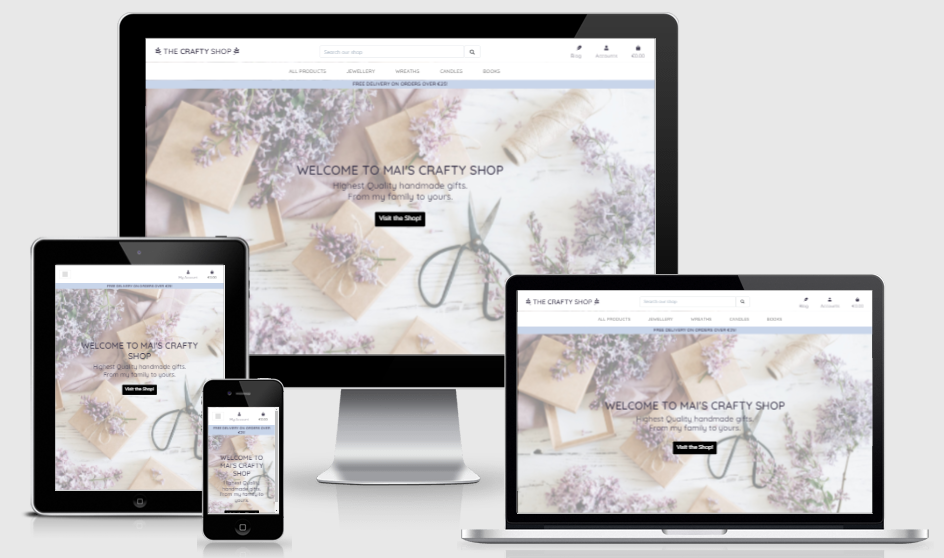
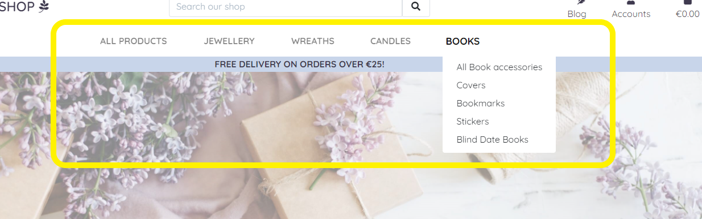

TESTING DOCUMENT [Return to ReadMe file](README.md)

## OVERVIEW

The main reason behind creating this test documentation is to reduce any bugs and errors left on the software, like not working links, responsive issues, font-sizes... and this way improve User Experience and increase traffic to the site.

From the very beggining I used Google Chrome Dev Tools to style and fix the code on real time. This helped fix mistakes and errors on a timely manner as the tool helped to see responsive, styling and typo errors as I coded.

Once finished, I tested my site on a two different phones, laptop, tablet and desktop as well as DevTools and different browsers manually.

 <small> The website is fully responsive in most devices </small> 

---

## Testing Table of Contents

### 1. [VALIDATOR](#validation)

### 2. [USER STORY TESTING](#user-story-testing)

### 3. [BROWSER COMPATIBILITY AND DEVICE RESPONSIVENESS TESTING](#browser-compatibility-and-device-responsiveness-testing)

### 4. [GOOGLE LIGHTHOUSE TESTING](#google-lighthouse-testing)

### 5. [BUGS](#bugs)

## VALIDATOR:

During the whole project, I continuously checked my code using W3 Validators to make sure I fixed my code as I wrote it. At the end, I ran all the finished pages and made sure all the errors were fixed.

As a css validator, I also used w3 Validator to make sure it checked my style.css file to CSS level 3 + SVG standards.

(See passed validator results at the end of HTML and CSS sections)

### HTML Validator:

- As to develop this project Djangos templating code was used, the validator would count all  as errors. So I had to validate the code introducing the URL on the [W3 Validator](https://validator.w3.org/) to check the whole website.

- The validator gave a warning because a of repeated head tag and typos on aria-labelledby, this were removed and fixed immediatelly. 

- 

---

### CSS Validator
- The [jigsaw validator](https://jigsaw.w3.org/css-validator) did not find any significant errors.

- 

---

### JSHint Validator
- [JSHint](https://jshint.com/) the undefined variable Stripe and the use of JQuery $ syntax, both which have been ignored due to correct use.

- 

---

### Python Validator
- [Python Checker](https://www.pythonchecker.com/) was a great use when I could not see a small issue on a small paragraph. It helped understand the warning I was getting on the terminal by Flake8. I fixed the code as I went typing along. At the end of the project, I run 'flake8' on my terminal again, and I made sure all the syntax errors were due to internal django bugs or style based.

## USER STORY TESTING:

- This project has been tested to make sure the webshop works well on almost any moder device. The user will be able to access to the shop from any chosen device regardles the viewport (Please see the mockup image above to demonstrate this)

- View the list of products/services:
    - As soon as the user arrives to the landing page, they are presented with all the product categories. When they click on them they have the subcategories within, that they can use to quickly access the products they are interested on.

    

- View individual product/service details:
    - Shoppers have the option to Click on top of the image of the product they want to know more about and this brings them to the product detail view where they can see all the information for each particular product. 

    

-  View owner portfolio
    - All the users hand creations are listed as products for shoppers to look at. As all the products are showing, this is a big portafolio for the artist/creator/shop owner.

    - The creator has a blog to show their users their crafting capabilities. This brings the shop owner more credibility as they are sharing tips that they use for their craftign business

    

    

- View the total of products/services ordered for purchase:
    - The shopper can see the total amount of the items added to the bag from the icon on the top, from the summary of the shopping bag commit down from the navbar and at the bottom of the bag page

    

    

- Register for an account:
    - The user has the oportunity to register whenever they want. The Account symbol is always on the top, letting the user have the option to login or register when they want to, even on mobile.

    

    

    

- Login and logout

    - Already registered users can login and logout form the navbar, this will bring them directly to the form:

    

    

    

- Recover Password if forgotten

    - Users can click on the Forget Password tab. An form will ask to enter their information and a confirmation email will let them know an email is on their way. The fucntionality of recovering their passwords will be implemented on a future release.

    

    

    

- Receive email confirmation after registering

    - When users register for a new account, a verification email will be sent to them. Once they verify the email sent to the email provided, they will have to confirm it on the webpage, and once they confirm it they'll be shown a success message to let them know everything went well

    

    

    

    

- Have a personalised user profile

    - Registered users will have their own profile, where they can update their personal infomration, as well as seeing their old orders and details of each

    

- Sort the list of available product/services:

    - On the navbar, the users can see all the categories of products the shop offers. They can access all of them directly from the navbar. Each category has product type inside it, so the users can choose hwat suits them best

    

- Sort product/services categories

    - The users have a few different way to organize the products they want to see. These options are under 'All products' tab. The user will have the products organizes by the option they chose. (Categories in here are organised Alphabetically)

    

- Search for a service/product by name or descrition
and
- View search results for each search

    - User are able to look for their product introduccing key words on the searchbar if they dont know which product they want.
    - The user can see how many products are under the criteria and what word was used to organise it.
    - On the blog, the user is presented with different categories. Once they select that category subject all the posts related are shown on the right organised by date

    

    

    

    

- Select options/quantity for product/service during purchase

    The user can choose the amount of items of the same product they would like to from the product detail page or from the cart. The amounts chosen are shown with thr product decription or the bag. If the product has sizes, the user can choose the size of the product. The price updates accordingly with the amount of products chosen.

    

    
    
    

    

- View items in shopping cart to be purchased
    Users will be able to see summary of their purcases before they commit, in case they want to update the cart, by Using CRUD functionality: remove an item, edit/update cart/ view cart, add more items

    

- Easily enter payment information

    The payment set up with stripe, is a very intuitive and simple form. The user can see in the right hand side what they are paying for and how much they will be charged. If the user is registered, the form is prefilled with their previous information.

    

    

- View order confirmation after checkout
AND
- Receive email confirmation after checkout is completed

    Users will receive a summary of the payment on the screen once it has gone through, but they will also receive an email with all the information.

    

    

-  Add new product/service/post/review/comment

    - Only registered and activated superusers will be able to add a new product.

    

    
    
    

    

    

    

- Edit/update product/service/post

    - Superusers have the hability to edit produts from prefiled forms, so they can choose what they want to change.

    

    

    

    

- Delete product/service/post/comment

    - Superusers have the posibility to remove everything except review comments. All detele buttons are red to see them better. There is no defensive mechanism in place for this release, so on product detail there is small note for the superusers to let them know is irreversible:

    

    

    

---

## BROWSER COMPATIBILITY AND DEVICE RESPONSIVENESS TESTING

While developing this project, I kept thoroughly testing the localserver on different viewports. The majority of the coding was done on a 32" monitor, so I found a few challenges to fit both very big and small screens. The deployed version was tested on a samsung galaxy s21ultra, as well as on a samsung 5e tablet and a one plus pro 9 phone. 

Testing the project on so many different viewports has helped me continoutly adapting the look of it:

### Devices

**One Plus Ultra**

**Samsung Galaxy S21 Ultra**

**Samsung Table 5e**

### Browers

I tested the project thoroughly on the main browsers I have access to. Unfortunatelly I ws not able to test the project on a ios and os systems this time.
Below it can be seen that there were almost no differences between browsers.

**Microsoft Edge**

**Chrome**

**Opera**

--- 

## GOOGLE LIGHTHOUSE TESTING

- Once the project was deployed and almost ready, I tested the project both for mobile and desktop using Google Developer tools Lighthouse application.

I found that due to the use of very simple colors I was able to keep the performance very high, both of phone but especially in desktop view:

### Desktop

### Mobile 

---

## BUGS

Here are the major issues I faced while builidng this project:

1. The requirements.txt filled up automatically one day and I had lots of uneccesary packages intalled. After that, everytime I opened the workspace I had to reinstall everything.
    - Tutor support found this to be a consecuence of a gitpod upgrade, but Igor tidied my requirements.txt, so I could install just the necessary packages. 

2. Button not aligning center: especially at the bottom of the forms, it always aligned in the right. To fix this I added an extra row and col under the form and I added text-center to the row. This fixed the issue, so I apply the same logic to all the buttons that were not on the right place.

3. One of the biggest issues I had was with the image field. When I submitted the form without any image, it broke all the code. I did not know how to fix this as I couldn't see where the problem was. After a long time searching on stackoverflow and slack and not finding a solution, I noticed I forgot to add the no image logic inside the template. As soon as I added this it fixed the issue. 

4. Towards the end of the testing, I noticed that when I tried to edit a category of a blog post, the server gave a status 500.  As I checked on the terminal using my workspace to test it again, I noticed that while the refractoring on the code I must have removed some extra templates that I was not supposed to touch. Creating another template and adding the logic back fixed this issue.

### Known Bug:

1. During the testing, I noticed that in the blog detail page, at the bottom of the comment form, there is no margin at the bottom, making it a little awkward to see for non logged users. Although I try to fix this using Dev tools, moving something meant the rest where moving in other directions too. Due to the last of time left before the project submission, I decided to leave this bug the way it is, since althought awkward, it doesn't look very bag on mobile screens, and it is no the main part of the whole application.